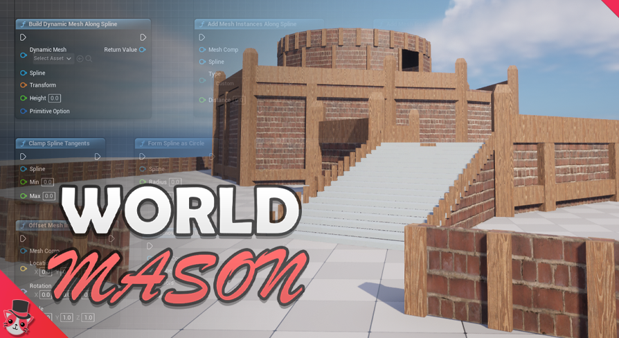
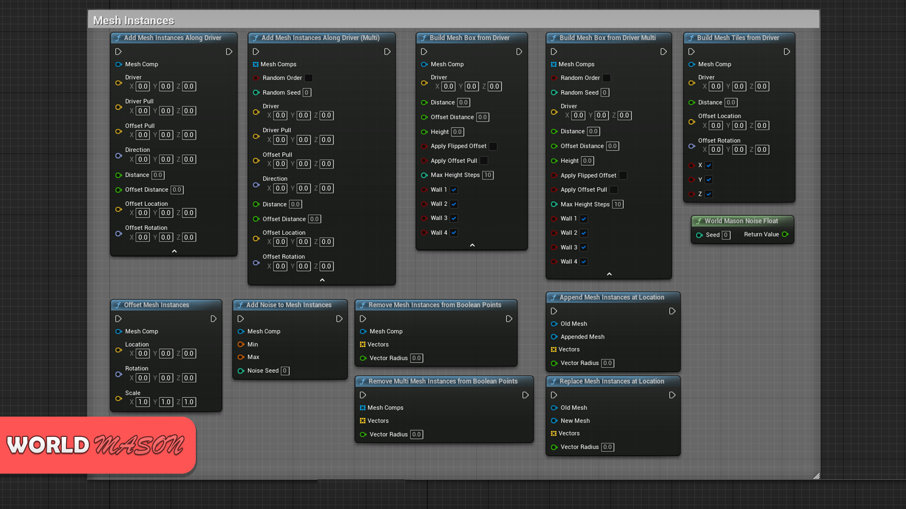
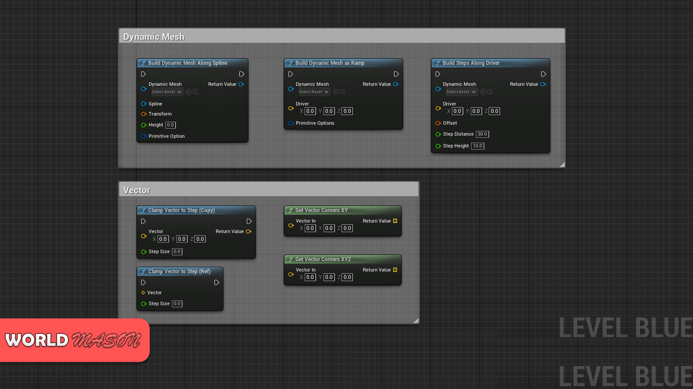
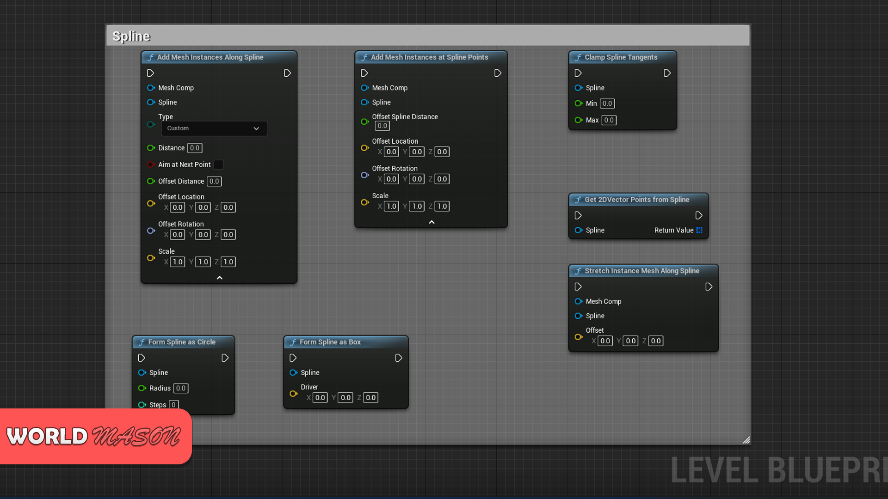
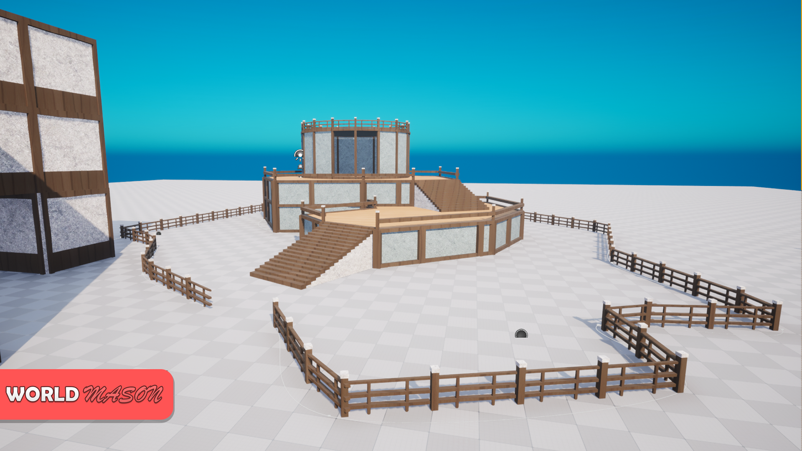
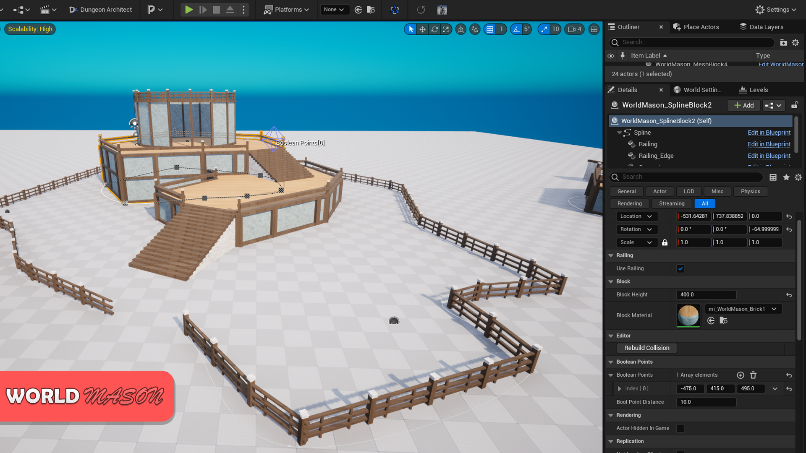
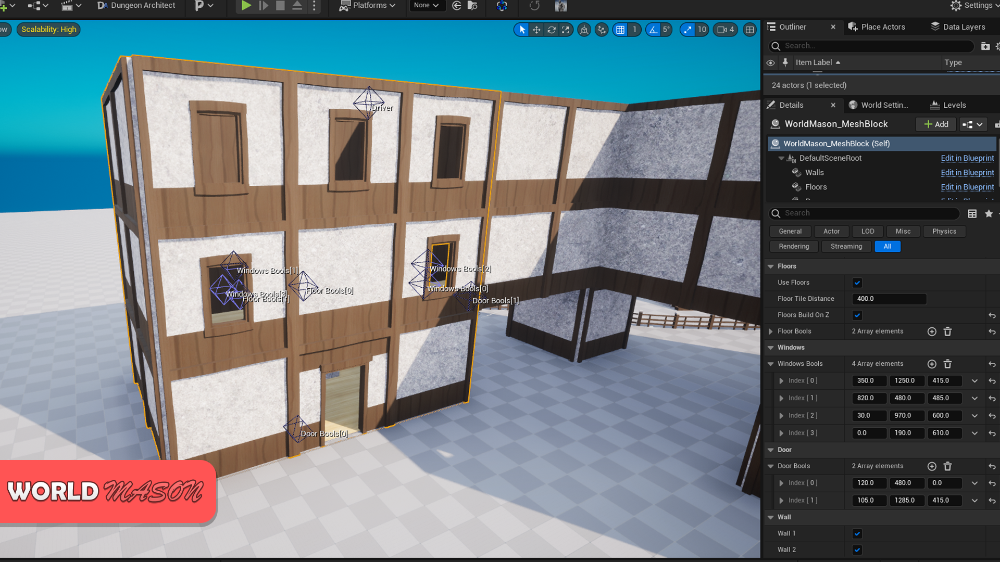

# WorldMason
[VIDEO](https://www.youtube.com/watch?v=04sKgMgwYOs) | [DOCUMENTATION](https://docs.google.com/document/d/1WMiur9GwXUvaoYRXZl_jV45AzRJr-Su2CKGt9Hn_26g/edit?tab=t.0)

A collection of functions and systems for building levels faster, using splines, mesh instances, and dynamic meshes. Use for houses, bridges, walls, fences, platforms, and more!

